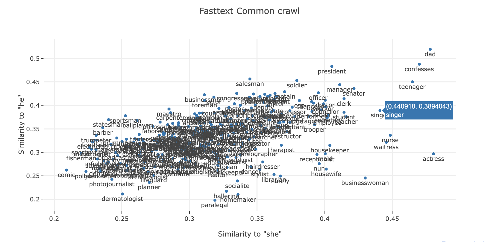
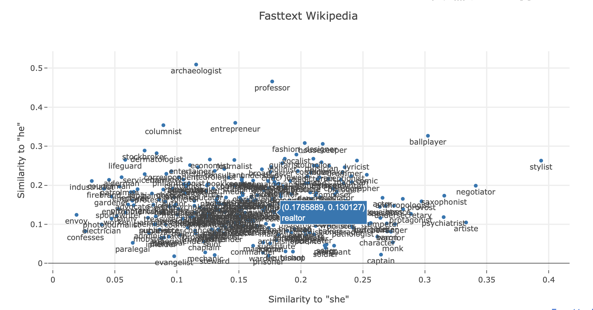

## DATA-512 Human Centered Data Science Final Project 
Course link: https://wiki.communitydata.cc/Human_Centered_Data_Science_(Fall_2018)

### Abstract

Word embedding models like word2vec and GloVe are widely used today as the 'first-step' in most NLP pipelines. Several pre-trained models exist, and each model captures the biases of the community that had produced the raw text data on which the model was trained. This project will compare the binary gender bias between different internet communities (Wikipedia vs General Web Common Crawl, and Twitter vs Common crawl) using word embedding models that were trained on text from those websites.

### Datasets and Pre-trained Models

#### Facebook Fasttext Models
- Common crawl dataset: https://s3-us-west-1.amazonaws.com/fasttext-vectors/crawl-300d-2M-subword.zip
- Wikipedia dataset: https://s3-us-west-1.amazonaws.com/fasttext-vectors/wiki.en.vec

https://nlp.stanford.edu/projects/glove/

Description: (as described on the fasttext website)
>The first line of the file contains the number of words in the vocabulary and the size of the vectors. Each line contains a word followed by its vectors, like in the default fastText text format. Each value is space separated. Words are ordered by descending frequency.

The pre-trained models listed in the link above are licensed under Creative Commons Attribution-Share-Alike License 3.0. https://creativecommons.org/licenses/by-sa/3.0/

#### Stanford GloVe Models
- Large common crawl dataset: http://nlp.stanford.edu/data/glove.840B.300d.zip
- Small common crawl dataset: http://nlp.stanford.edu/data/glove.42B.300d.zip
- Twitter dataset: http://nlp.stanford.edu/data/glove.twitter.27B.zip

https://nlp.stanford.edu/projects/glove/

Description:
The data format for the text files is exactly the same as for FastText models listed above.

The following models are available: (descriptions from https://nlp.stanford.edu/projects/glove)
- Wikipedia 2014 + Gigaword 5 (6B tokens, 400K vocab)
  - Source data: http://dumps.wikimedia.org/enwiki/20140102/ and https://catalog.ldc.upenn.edu/LDC2011T07
- Common Crawl (42B tokens, 1.9M vocab)
  - Source data: http://commoncrawl.org/the-data/
- Common Crawl (840B tokens, 2.2M vocab)
  - Source data: http://commoncrawl.org/the-data/
- Twitter (2B tweets, 27B tokens, 1.2M vocab)
  - Source data: From twitter using the script at https://nlp.stanford.edu/projects/glove/preprocess-twitter.rb

This project will not be using the original datasources of the models; I will be using the pre-trained models distributed by nlp.stanford.edu under the Public Domain Dedication and License v1.0. http://www.opendatacommons.org/licenses/pddl/1.0/.

#### List of occupations:

A list of words relating to occupations, which are used to compare models.
Source: https://github.com/tolga-b/debiaswe/blob/master/data/professions.json, 

The data in the repository is licensed under MIT.

### Research question:

How do web communities differ in their gender biases? 
 - Comparing Wikipedia to Common crawl.
 - Comparing Twitter to Common crawl.

### Findings:

The above visualizations show all occupations along with their similarities to both the axes.
If the model were perfectly unbiased, we would expect all the words to lie the x=y line through the origin.

The spread of the points around this line is an indication of bias, and for the wikipedia data, most of the words seem clustered at about the same location around (0.15, 0.12), which shows a slight bias towards 'she' for the list of occupations we've chosen.

Similar plots for the fasttext model trained on the Common craw data set shows the similarites have larger magnitudes in general. The cluster center in this case is very close to the x=y line suggesting that most of the occupations we've chosen are equally biased towards 'he' and 'she'

### References:

References

- Llorens, Marisa (2018) "Text Analytics Techniques in the Digital World: Word Embeddings and Bias," Irish Communication Review: Vol. 16: Iss. 1, Article 6. doi:10.21427/D7TJ05 Available at: https://arrow.dit.ie/icr/vol16/iss1/6
- Demographic Word Embeddings for Racism Detection on Twitter, Mohammed Hasanuzzaman, Gae ̈l Dias, Andy Way: http://www.aclweb.org/anthology/I17-1093
- Quantifying and Reducing Stereotypes in Word Embeddings, Tolga Bolukbasi Kai-Wei Chang James Zou Venkatesh Saligrama Adam Kalai: https://pdfs.semanticscholar.org/2558/231cadaf0b1a4ac79d1a5c79322c8fbd327f.pdf
- Quantifying and Reducing Gender Stereotypes in Word Embeddings: https://drive.google.com/file/d/1IxIdmreH4qVYnx68QVkqCC9-_yyksoxR/view
- Man is to Computer Programmer as Woman is to Homemaker? Debiasing Word Embeddings: Tolga Bolukbasi, Kai-Wei Chang, James Zou, Venkatesh Saligrama, Adam Kalai: http://papers.nips.cc/paper/6228-man-is-to-computer-programmer-as-woman-is-to-homemaker-debiasing-word-embeddings.pdf
- Jeffrey Pennington, Richard Socher, and Christopher D. Manning. 2014. GloVe: Global Vectors for Word Representation.

